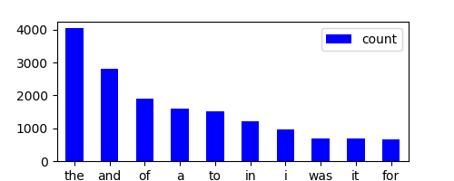

```{r setup, include=FALSE}
knitr::opts_chunk$set(echo = FALSE, fig.width = 2)
library(cowsay)
```

## The most frequent words in the 4 novels we studied:

#### Isles:


```{r Isles}
knitr::include_graphics("../results/figure/isles.png")
```

#### Abyss:

```{r Abyss}

```


#### Last:

```{r Last}
knitr::include_graphics("../results/figure/last.png")
```


#### Sierra:

```{r Sierra}
knitr::include_graphics("../results/figure/sierra.png")
```

And to end this happy story...
```{r arrested development endless horse random quote}
say(what = "arresteddevelopment", by = "endlesshorse")
```
